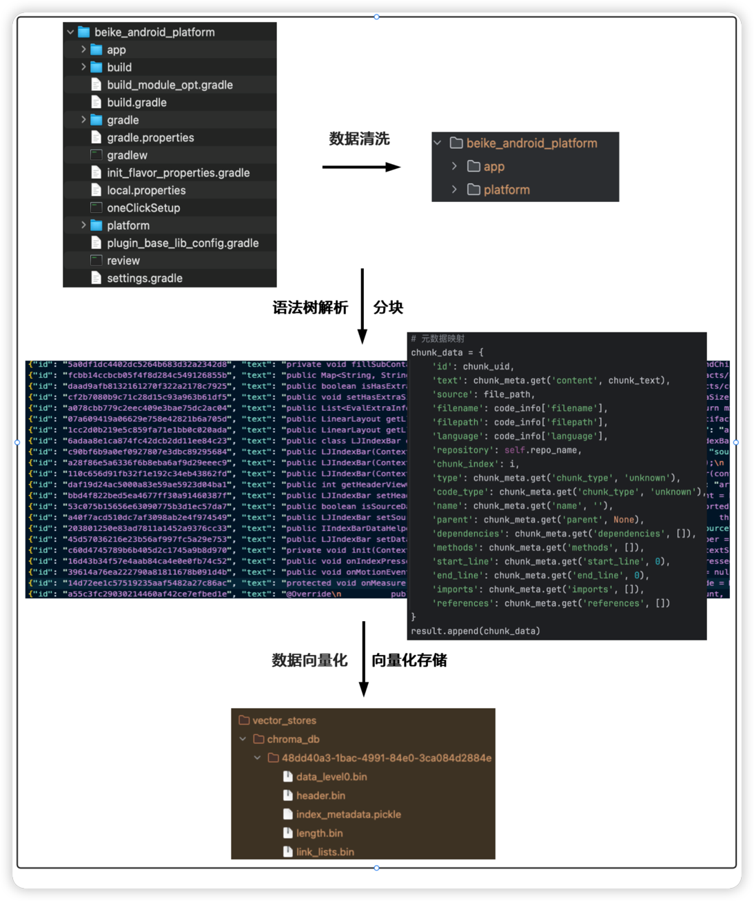
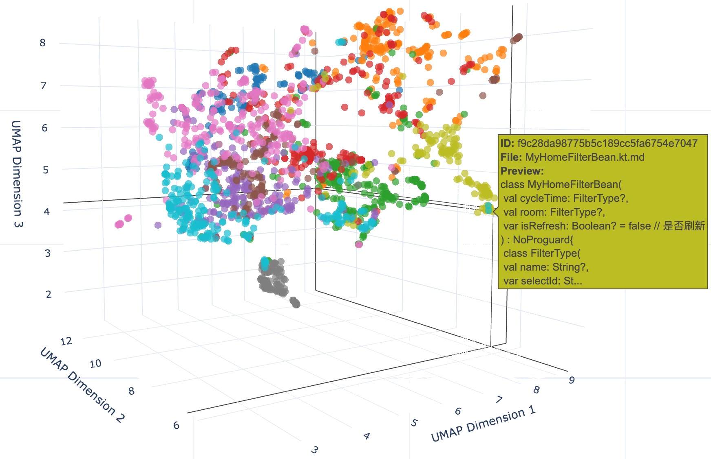

## RepoRAG-MCP

RepoRAG-MCP的目的是使用RAG（检索增强生成）对本地数据建立知识库，使用MCP Server获取知识库信息以提供统一的API给Agent调用。这样Agent可以根据用户的语义输入去查询RAG-MCP并返回给用户查找的数据。

### RAG
RAG将检索的数据作为知识库并发送给LLM，以增强大模型在专业型、实时性等方面的不足

### MCP Server
MCP Server是一个运行在本地的程序，能够以一致的方式将各种数据库、工具和功能连接到LLM。

## 项目步骤：

1. 对本地代码仓库进行数据清洗，去除依赖文件和代码生成文件等;
2. 对清洗后的代码数据进行语法树解析。
使用 Tree-sitter 对不同的编程语言进行语法树解析，并按照指定大小进行分块;
使用元数据为每个块保留代码的依赖关系、编程语言、文件路径、代码类型等，提升检索效率;
3. 对分块数据进行向量化。使用sentence-transformers对数据进行向量化，使用chromadb存储向量数据;
4. 构建 MCP Server，方便 LLM 根据用户的查询请求进行语义分析，调用 MCP Server 提供的 API 进行知识库查询;

## 项目流程图


## 环境要求
- Python >= 3.10

## 使用步骤

1. 安装依赖:
```bash
cd RepoRAG-MCP
pip install -r requirements.txt
```
2. 一键RAG
```bash
python local_repo_process.py --path /path/to/repo
```

3. 可视化（若需要）
```bash
python codeVisualize.py --collection collection_name
```


4. MCP Server配置
```json
{
  "mcpServers": {
    "reporag-mcp": {
      "command": "uv",
      "args": [
        "run",
        "/Users/EugeneYu/Documents/RepoRAG-MCP/mcpServer.py",
        "--chromadb-path",
        "/Users/EugeneYu/Documents/RepoRAG-MCP/artifacts/vector_stores/chroma_db",
        "--collection-name",
        "code_beike_android_platform_code_chunks_ast_all-MiniLM-L6-v2"
      ],
      "description": "代码仓库语义搜索服务，提供自然语言代码检索功能"
    }
  }
}
```

## Vector Storage

codeChunker根据以下特征存储在 ChromaDB 中：
- 使用sentence-transformers生成的语义向量嵌入
- 高效的相似度搜索
- 元数据过滤
- 上下文关系

## 增量构建
```bash
python localRepoProcess.py --path /path/to/repo #默认使用增量构建
```

- 首次运行时会执行完整构建
- 如果怀疑缓存出现问题，可以使用 --no-incremental 强制完整构建
- 删除的文件会在下次完整构建时自动清理
- 构建缓存保存在 .build_cache 目录中
